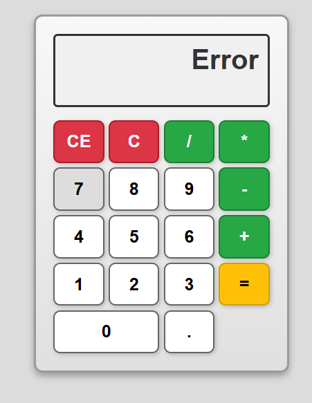
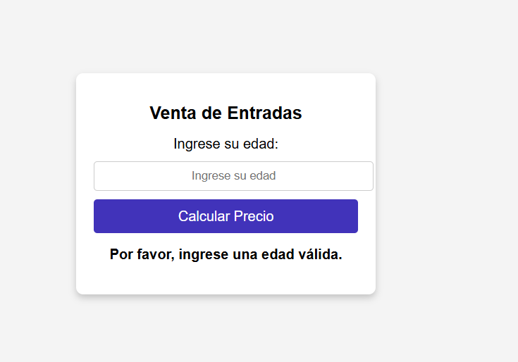
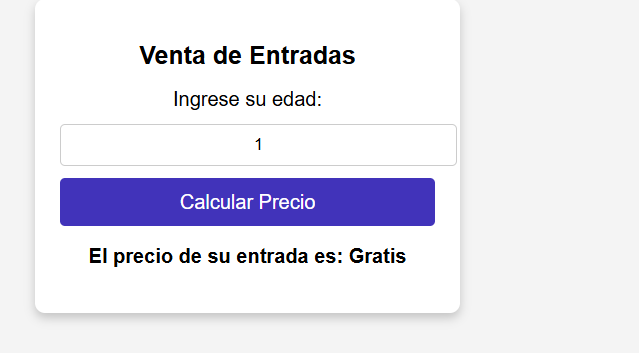
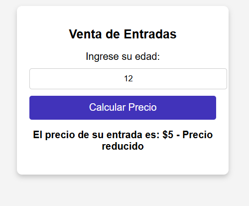
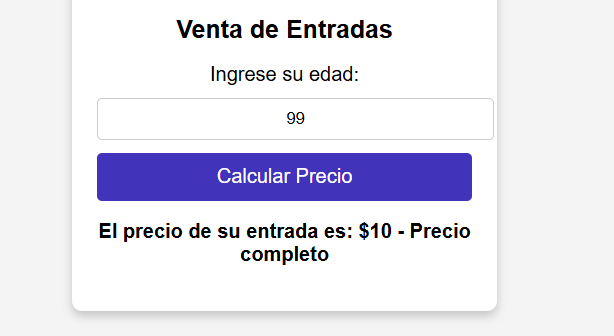

# js-ejercicios-calculadora-venta-entradas

La tarea incluye dos ejercicios en JS:

Calculadora: Una calculadora en la que se pueden realizar operaciones matemáticas 
(suma, resta, multiplicación y división) entre dos números ingresados por el usuario. 
Incluye validaciones para evitar errores como la división por cero o la introducción de 
valores no numéricos.

Da error si divides por 0, si combinas diferentes signos

Venta de Entradas: Calcula el precio de una entrada según la edad del usuario. 
Aplica descuentos o gratuidad según el rango de edad y gestiona errores en la entrada de datos.

Cuando no introducimos valores da error, y cuando introduces los valores de edades te pone el precio y la condicion de la entrada.

